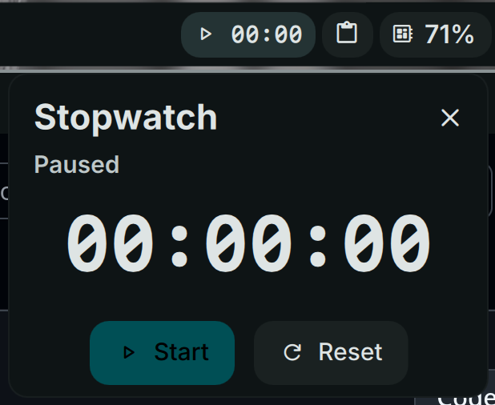

# Stopwatch

High-precision stopwatch with persistent state.



## Install


**Required:** This plugin requires [dms-common](https://github.com/hthienloc/dms-common) to be installed.

```bash
# 1. Install shared components
git clone https://github.com/hthienloc/dms-common ~/.config/DankMaterialShell/plugins/dms-common

# 2. Install this plugin
dms plugins install stopwatch
```

Or manually:
```bash
git clone https://github.com/hthienloc/dms-stopwatch ~/.config/DankMaterialShell/plugins/stopwatch
```

## Features

- **Millisecond precision** - Configurable 1, 2, or 3 digit display
- **Persistent state** - Survives bar restarts
- **Flexible display** - Full (`00:00:00`), compact (`1h 5m`), or minimal (`5m 10s`)

## Usage

| Action | Result |
|--------|--------|
| Left click | Open controls |
| Right click | Start/pause |
| Enter key | Reset |

## License

GPL-3.0

## Roadmap / TODO

- [ ] **Lap Timing**: Implement lap recording with a scrollable history view in the plugin popup.
- [ ] **Notification System**: Optional audio/visual alerts at configurable intervals (e.g., every 15 minutes).
- [ ] **Countdown Timer Mode**: Allow switching from stopwatch to a countdown timer with alarm support.
- [ ] **Session Export**: Capability to export lap times and session duration to a local CSV file.
- [ ] **Enhanced Controls**: Add keyboard shortcuts for start, pause, and lap when the widget is focused.

